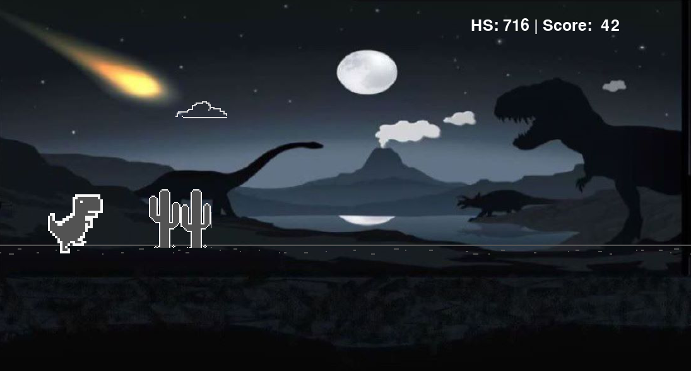

# Dino Runner - Chrome Dino Game

Una copia del juego de Chrome Dino (T-Rex Runner) desarrollado en Python usando Pygame. El juego presenta un dinosaurio que debe evitar obstáculos mientras corre a través de un paisaje desértico, con power-ups especiales.

## Descripción

Este proyecto es una recreación del juego del dinosaurio de Google Chrome con funcionalidades adicionales. El jugador controla un dinosaurio que debe saltar o agacharse para evitar cactus y pájaros mientras la velocidad del juego incrementa. El juego incluye power-ups como escudos y martillos que le dan habilidades especiales al dinosaurio.

## Características

- **Jugabilidad clásica**: Controles simples e intuitivos (saltar, agacharse, lanzar martillo)
- **Obstáculos variados**: 
  - Cactus pequeños y grandes
  - Pájaros voladores a diferentes alturas
- **Sistema de Power-ups**:
  - **Escudo**: Protege al dinosaurio de un impacto
  - **Martillo**: Permite destruir obstáculos lanzando un martillo
- **Sistema de puntuación**:
  - Puntuación en tiempo real
  - Registro de puntuación máxima (High Score)
  - Contador de muertes
- **Dificultad progresiva**: La velocidad del juego aumenta cada 100 puntos
- **Gráficos personalizados**: Assets temáticos con un fondo espacial/meteorito

## Controles

| Tecla | Acción |
|---|---|
| `↑` / `Espacio` | Saltar |
| `↓` | Agacharse |
| `A` | Lanzar martillo (si tienes el power-up de martillo) |
| `Cualquier tecla` | Iniciar/Reiniciar el juego (en el menú) |

## Requisitos

- Python 3.x
- Pygame

## Instalación

1. **Instalar dependencias**:
   ```bash
   pip install -r requirements.txt
   ```

2. **Ejecutar el juego**:
   ```bash
   python main.py
   ```

## Estructura del Proyecto

```
Juliana-Perez-2023-2-CO-Modulo-2/
├── main.py                          # Punto de entrada del juego
├── requirements.txt                 # Dependencias del proyecto
└── dino_runner/
    ├── __init__.py
    ├── assets/                      # Recursos gráficos
    │   ├── Dino/                   # Sprites del dinosaurio
    │   ├── Cactus/                 # Sprites de cactus
    │   ├── Bird/                   # Sprites de pájaros
    │   └── Other/                  # Fondos, power-ups, etc.
    ├── components/                  # Componentes del juego
    │   ├── game.py                 # Lógica principal del juego
    │   ├── dinosaur.py             # Clase del dinosaurio
    │   ├── menu.py                 # Menú de inicio/game over
    │   ├── score.py                # Sistema de puntuación
    │   ├── obstacles/              # Sistema de obstáculos
    │   │   ├── obstacle.py         # Clase base de obstáculos
    │   │   ├── cactus.py          # Obstáculo cactus
    │   │   ├── bird.py            # Obstáculo pájaro
    │   │   └── obstacles_manager.py # Administrador de obstáculos
    │   └── power_ups/              # Sistema de power-ups
    │       ├── power_up.py         # Clase base de power-ups
    │       ├── shield.py           # Power-up escudo
    │       ├── hammer.py           # Power-up martillo
    │       └── power_up_manager.py # Administrador de power-ups
    └── utils/
        └── constants.py             # Constantes y recursos del juego
```

## Mecánicas del Juego

### Sistema de Colisiones

- **Sin Power-up**: Cualquier colisión con un obstáculo termina el juego
- **Con Escudo**: El escudo absorbe un impacto y desaparece
- **Con Martillo**: Puedes destruir obstáculos lanzando un martillo con la tecla `A`

### Power-ups

Los power-ups aparecen aleatoriamente durante el juego:
- Aparecen por primera vez entre los puntos 50-70
- Luego reaparecen cada 200-300 puntos
- Duración: 3-5 segundos
- El temporizador se muestra en pantalla mientras el power-up está activo

### Incremento de Dificultad

- Velocidad inicial: 20 unidades
- Incremento: +5 cada 100 puntos
- Velocidad máxima: 500 unidades

## Detalles Técnicos

### Clase Game (`game.py`)
Gestiona el bucle principal del juego, actualización de componentes, renderizado y estados del juego (jugando, menú).

### Clase Dinosaur (`dinosaur.py`)
Maneja los estados del dinosaurio:
- Correr (con animación de 2 frames)
- Saltar (con física de gravedad)
- Agacharse (con animación)
- Estados especiales con power-ups (escudo, martillo)

### Administradores
- **ObstacleManager**: Genera obstáculos aleatoriamente, gestiona colisiones
- **PowerUpManager**: Genera power-ups en intervalos específicos, gestiona efectos

### Sistema de Puntuación
- Incremento continuo durante el juego
- Registro de puntuación máxima persistente durante la sesión
- Contador de muertes acumulativo

## Configuración

Las constantes del juego se pueden modificar en `dino_runner/utils/constants.py`:

```python
SCREEN_WIDTH = 1100    # Ancho de la pantalla
SCREEN_HEIGHT = 600    # Alto de la pantalla
FPS = 30               # Frames por segundo
```

## Solución de Problemas

### El juego no inicia
- Verifica que Pygame esté instalado correctamente: `pip install pygame`
- Asegúrate de estar ejecutando el juego desde el directorio raíz del proyecto

### Faltan imágenes
- Verifica que la carpeta `assets` contenga todos los recursos gráficos necesarios
- La estructura de carpetas debe mantenerse intacta

### El juego va muy lento/rápido
- Modifica la constante `FPS` en `constants.py` para ajustar la velocidad de renderizado
- La velocidad del juego incrementa automáticamente con la puntuación

**¡Disfruta jugando! 🎮🦖**



